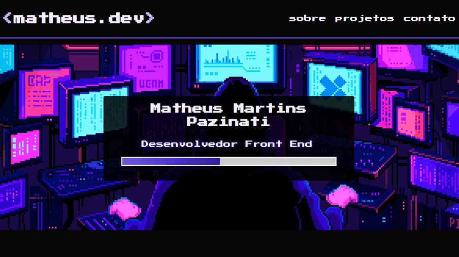

<h1 align="center"><matheus.dev></h1>

  

<h2>👨‍🎤 Sobre</h2>

Site do meu portfolio na área de desenvolvimento de software, com detalhes sobre minha vida pessoal e acadêmica, além de alguns projetos que desenvolvi, tudo isso com uma temática "retrô", baseada em jogos antigos (Pixel Art). 
Você pode visitar o site através deste link: <a href="https://matheus-pazinati.github.io/portfolio-matheus.dev">Acessar portfolio</a>

 
<h2>🎯 Objetivo</h2>

Mostrar minhas conquistas e projetos na área de tecnologia, além de aplicar na prática pela primeira vez alguns recursos do css como animações e transições. Além disso, o projeto serviu para reforçar e aplicar aprendizados de HTML e CSS, como tags semânticas, posicionamento de itens com Grid e Flex, inserção de imagens, entre outros.

 
<h2>🚀 Tecnologias utilizadas</h2>
  <ul>
    <li>HTML</li>
    <li>CSS</li>
    <li>Javascript</li>
  </ul>
 
<h2>📌 Melhorias a serem implementadas</h2>
  <ul>
    <li>Criar um botão que faça o download do meu currículo. - Ok ✔️</li>
    <li>Adicionar nova sessão de "Hard Skills" antes da sessão de Projetos</li>
    <li>Incluir uma sessão de "Hobbies e Curiosidades", mostrando por exemplo filmes e bandas que eu gosto.</li>
  </ul>
 
 

Made by Matheus Pazinati 🛸
